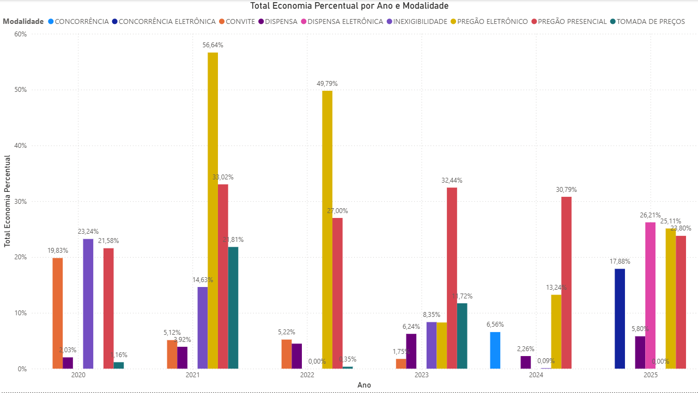
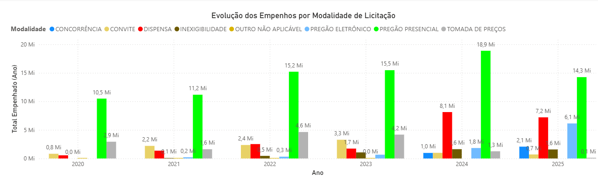
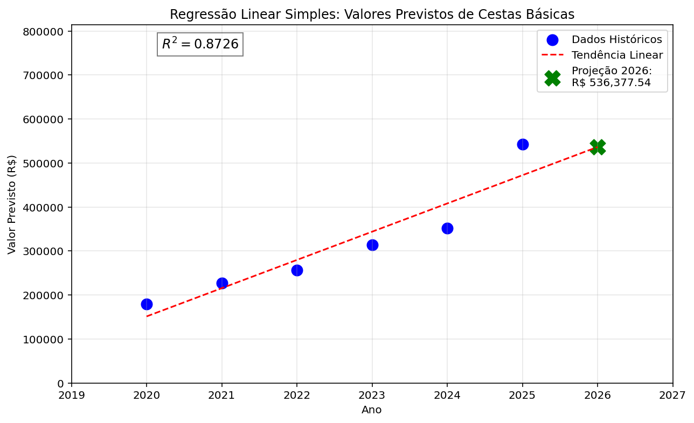
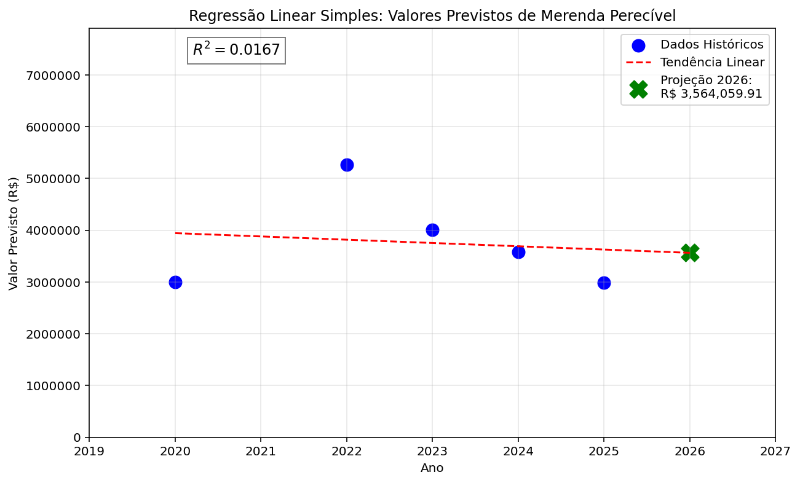
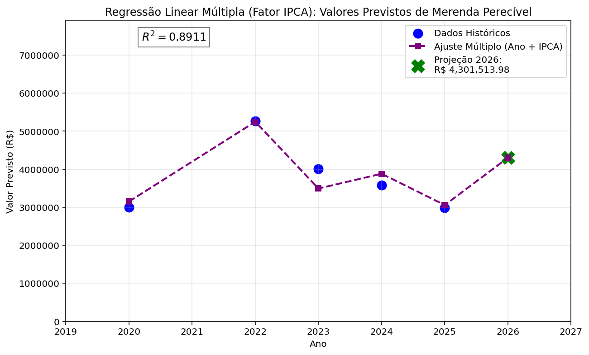

# LicitAnalytics

**Projeto de Ciência de Dados aplicado às licitações públicas do Município de Riolândia/SP.**

*Pipeline* completo de análise e ciência de dados públicos em Python: extração e *Data Wrangling* (limpeza, modelagem e tratamento dos dados), passando por *Business Intelligence*, até a modelagem preditiva utilizando *Machine Learning*.

**Última atualização (22/08/2026):** Implementação de modelo de Regressão Linear Múltipla, incorporando o índice IPCA (histórico de 2020-2025 e projeção para 2026) como variável adicional aos modelos de previsão de valores e economicidade em Python. Inclusão de filtros de função e subfunção contábeis e novo dashboard para Obras no Power BI.

Este projeto também é publicado como série técnica e newsletter no LinkedIn:
[Acompanhe a Newsletter no LinkedIn](https://www.linkedin.com/newsletters/licitanalytics-7489694212515323904/)

*O código deste repositório é atualizado de forma independente do cronograma de publicações no LinkedIn — quem acompanha por aqui pode estar alguns passos à frente da série.*

## Sobre o projeto

Licitações públicas geram uma quantidade absurda de dados e a maior parte das análises que existem por aí são jurídicas e não analíticas. O objetivo do LicitAnalytics é ocupar esse espaço vazio.

O projeto une conhecimento prático de quem atua diretamente com licitações (como Agente de Contratação e Pregoeiro) com ferramentas de análise de dados, através da unificação de bases históricas, tratamento e limpeza de dados, cálculo de indicadores de economicidade e modelagem preditiva para apoiar o planejamento de contratações futuras.

## Resultados em destaque

* **R² de 0,8726** no modelo preditivo simples de valores para **Cestas Básicas** — o objeto mais previsível e estável analisado na série até o momento.

* Injeção do índice IPCA como variável para a Regressão Linear Múltipla, provocando um salto de eficiência (de um R² de **0.01** no modelo simples para **0.89** no modelo múltiplo) ao modelar a Merenda Escolar, sugerindo uma possível dependência do orçamento à inflação.

**Disclaimer**: com apenas 6 pontos de dado anual, adicionar uma segunda variável ao modelo reduz bastante o grau de liberdade estatístico disponível. Um eventual ganho de R² no modelo múltiplo é tratado como evidência adicional para a hipótese de que a inflação influencia a economicidade — não como prova estatística definitiva. Essa limitação é discutida com mais detalhe na série publicada no LinkedIn.

## Tecnologias e Métodos

* **Python:** Pandas, NumPy, Scikit-Learn, Matplotlib
* **Power BI:** DAX avançado, Power Query, Criação de Dashboards interativos
* **Modelagem Preditiva (*Machine Learning*):** 
    * Regressão Linear Simples.
    * Regressão Linear Múltipla (com injeção do IPCA).
* **Engenharia de Dados:** ETL, *Data Wrangling* e *Feature Engineering* (Criação de métricas personalizadas em Python e medidas no Power BI).

## Funcionalidades

* Unificação de 6 anos de bases de dados de licitações (2020 a 2025).
* Tratamento e limpeza de dados extraídos do Portal da Transparência.
* Cálculo de economicidade absoluta e percentual, por modalidade e por objeto
* Dashboards interativos no Power BI para as Licitações.
* Modelos de regressão linear simples para previsão de valores e de economicidade
* Modelo de regressão linear múltipla, incorporando o índice IPCA histórico e projetado como variável adicional.
* Unificação, tratamento e limpeza de dados de execução orçamentária (empenhos, liquidações, pagamentos e anulações) de 2020 a 2025.
* Dashboards interativos no Power BI para a execução orçamentária
* Isolamento de chaves contábeis (Função e Subfunção) para rastreio de gastos específicos (Ex: Subfunção 306 - Alimentação e Nutrição).

## A série LicitAnalytics

A Season 1 do projeto foi publicada como uma série de análises técnicas no LinkedIn, cada uma dissecando um recorte diferente do ecossistema de compras públicas:

**Episódios (Season 1):**
* **#1** Evolução dos gastos com licitações (2020–2025)
* **#2** Economicidade por modalidade de contratação
* **#3** Pregão Presencial vs. Pregão Eletrônico
* **Spin-Off #1** Valor licitado vs. valor empenhado
* **#4** Evolução dos gastos com Medicamentos
* **#5** Evolução dos valores com Merenda Escolar
* **#6** Modelo preditivo — Merenda Escolar
* **Spin-Off #2** O que influencia a economicidade de uma contratação pública
* **#7** Modelo preditivo — Medicamentos
* **#8** Modelo preditivo — Cestas Básicas

A série continuará com novos ciclos de análise focados em Inteligência Orçamentária. 

## Próximas etapas

- Análise exploratória (EDA) mais aprofundada por objetos de contratação.
- Criação de novos indicadores de execução orçamentária e eficiência de pagamentos.
- Comparação sistemática entre valores previstos (planejamento), valores homologados (ata) e valores empenhados (realidade).

## Autor
**Leonardo Amaral**  
*Engenheiro de Computação | Estudante de Ciência de Dados | Analista de Dados | Especialista em Licitações*  
[Conecte-se no LinkedIn](https://www.linkedin.com/in/leogamaral13/)