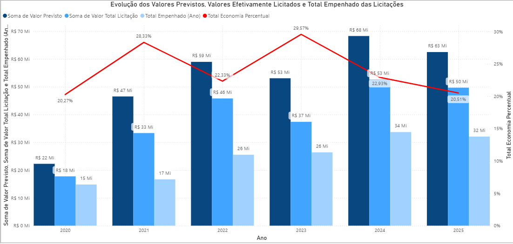
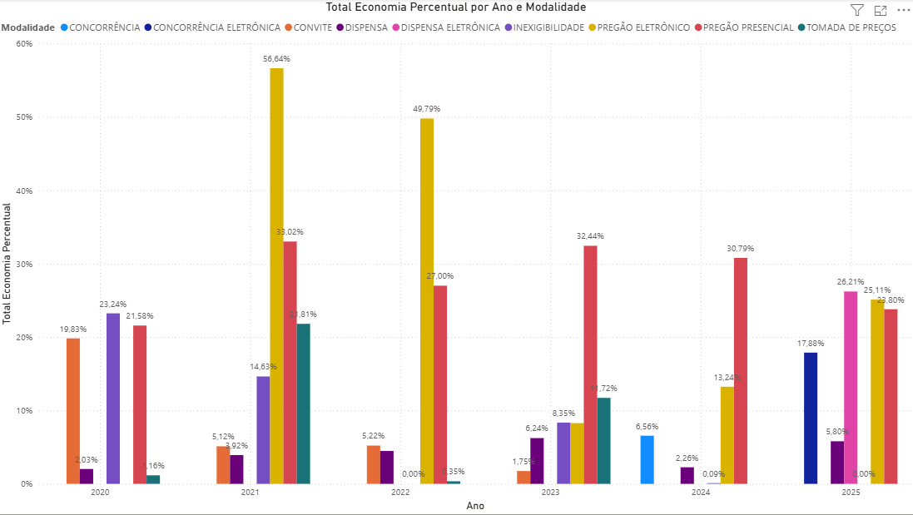
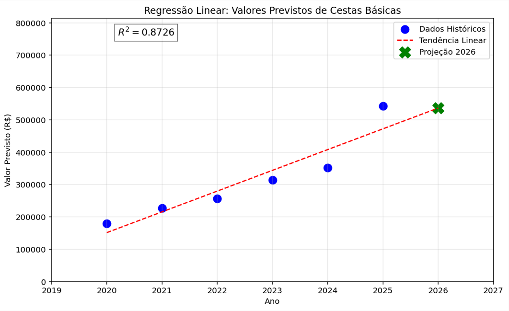

LicitAnalytics

Projeto de Ciência de Dados aplicado às licitações públicas do Município de Riolândia/SP.

Análise de 6 anos de processos licitatórios (2020–2025), com ETL em Python, dashboards interativos em Power BI e modelos preditivos de regressão linear para valores e economicidade de futuras contratações.

# Última atualização: análise de dados de empenhos, liquidações, pagamentos e anulações de despesas entre os anos de 2020 e 2025.

Este projeto também é publicado como série técnica e newsletter no LinkedIn:
https://www.linkedin.com/newsletters/licitanalytics-7489694212515323904/

O código deste repositório é atualizado de forma independente do cronograma de publicações no LinkedIn — quem acompanha por aqui pode estar alguns passos à frente da série.

# Sobre o projeto

O objetivo do LicitAnalytics é ir além da leitura jurídica tradicional de processos licitatórios e tratar a licitação pública como o que ela também é: uma fonte massiva de dados públicos, subutilizada.

O projeto une conhecimento prático de quem atua diretamente com licitações (como Agente de Contratação e Pregoeiro) com ferramentas de análise de dados, através da unificação de bases históricas, tratamento e limpeza de dados, cálculo de indicadores de economicidade e modelagem preditiva para apoiar planejamento de contratações futuras.

# Resultados em destaque

R² de 0,8726 no modelo preditivo de valores para Cestas Básicas — o objeto mais previsível analisado na série

# A série LicitAnalytics

A Season 1 do projeto foi publicada como série de análises técnicas no LinkedIn, cada uma explorando um recorte diferente dos dados de licitação:

#	Temas
1	Evolução dos gastos com licitações (2020–2025)
2	Economicidade por modalidade de contratação
3	Pregão Presencial vs. Pregão Eletrônico
Spin-Off 1	Valor licitado vs. valor empenhado
4	Evolução dos gastos com Medicamentos
5	Evolução dos valores com Merenda Escolar
6	Modelo preditivo — Merenda Escolar
Spin-Off 2	O que influencia a economicidade de uma contratação pública
7	Modelo preditivo — Medicamentos
8	Modelo preditivo — Cestas Básicas

A série continua com novos ciclos de análise. Acompanhe as próximas publicações pela newsletter no LinkedIn.

# Tecnologias
- Python
- Pandas
- NumPy
- Scikit-Learn
- Matplotlib
- Power BI
- DAX
- Power Query
- Dashboards
- Regressão Linear para modelagem preditiva de valores e economicidade

# Funcionalidades
- Unificação das bases de dados de licitações de 2020 a 2025
- Tratamento e limpeza de dados extraídos do Portal da Transparência
- Cálculo de economicidade absoluta e percentual, por modalidade e por objeto
- Dashboards interativos no Power BI para as Licitações
- Modelos de regressão linear para previsão de valores e de economicidade
- Unificação, tratamento e limpeza de dados de execução orçamentária (empenhos, liquidações, pagamentos e anulações) de 2020 a 2025
- Dashboards interativos no Power BI para a execução orçamentária

# Próximas etapas
- Análise exploratória (EDA) mais aprofundada por objeto de contratação
- Novos indicadores de execução orçamentária
- Expansão dos modelos preditivos para novos recortes de dados
- Comparação sistemática entre valores previstos, valores homologados e valores empenhados

# Autor
Leonardo Amaral
Engenheiro de Computação | Estudante de Ciência de Dados | Analista de Dados | Especialista em Licitações

https://www.linkedin.com/in/leogamaral13/